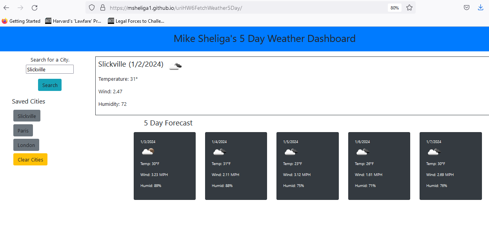
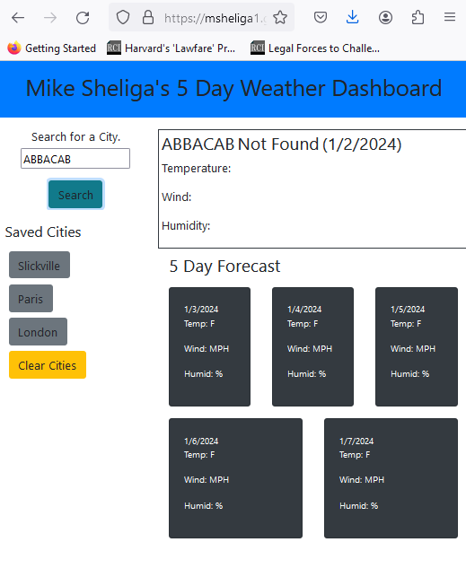

# uriHW6FetchUrl
URI Bootcamp hw 6 Due 1.2.24 - Fetch URLs - Weather App - 5 Day Forecast for User Input City 
Michael Sheliga - Started Sat 12.30.23 - Due Tues 1.2.24

This repo is for the University of Richmond (URI) coding bootcamp.   

## Link to Repo and Deployed Webpage
Link to GitHub Repo: https://github.com/msheliga1/uriHW6FetchUrl
Link to deployed github.io site. https://msheliga1.github.io/uriHW6FetchUrl  
Link to screenshot of deployed github.io site.    
Link to screenshot of 2.    

## Project Goals  
Use the 3rd party openweatehrmap API, jQuery, fetch, local storage and a the BootStrap CSS framework, to create a 5-day weather application. 
The user will type a city name into a form, upon submit the API will be used to get latitude-longitude for the city, and the 
API will then be used to get the 5 day weather forecast. If the city exists it will be saved to local storage.    
A sample API call: api.openweathermap.org/data/2.5/forecast?lat={lat}&lon={lon}&appid={API key} 2603ab2cb7ddafbe94e3a350338be59b
Note that using this key in a public repo effectively makes the openweathermap key public. 

==============================================================================================================================
## Technical Project Details 
==============================================================================================================================
## Github:  
    Create Repo (github, repositories => New)  
        - Dont Make this a shared repo. 
    Copy directories and sample files from prior project (or create from scratch). 
        -- No starter code. No need for copying one file at a time via command line. Worked well.
        -- Alternate: Go to Demo (root) folder, download zip, moving to local repo, unzip - likely fastest method.     
        -- Could not find a better way to copy over all files.    
        -- OR ... create HTML, CSS and javascript, etc. from scratch or sample files ...  
    Branches (Optional for single programmer projects)
        - Could do work in branches. (new branch inside gitHub)  
        - All branch names will begin with the initials of the main person working on the branch.  
        - Must update local repo after adding a branch  
        - Switch to branch: From cmd line git switch <branchname>  
        - Once changes committed, git push origin <branchname>  
            - for pushing to remote test branch: git push origin local_branch:remote_branch
        - Issue a pull request in gitHub.
        - Click "Pull Requests" in top menu bar (3rd from left).
        - Click "review Required" in small font below pull request name.
        - You may approve your own request.  
    Clone to local machine (Copy https, then git clone paste).    
    Create a nice long READ.md file!!  (Modify prior projects.)   
    Commit and push files back to gitHub branch. (For multi-programming: Issue pull request, approve, merge). 
    Deploy code (Settings...CodeAndAnimation->Pages on left, GitHub Pages->Branch->main, save)
        - Deployed code name always msheliga1/github.io/RepoName !!
    Make Sure it Works  
    Insert Screenshot X2 of deployment into readme file.  
  
## Tools and Technologies Used - HTML, CSS Bulma Framework and JQuery   
    Github - Could use branches
    Create/Modify HTML 
    Modals - May use, may not
    CSS Framwork Bootstrap
    Javascript/JQuery 
    Local Storage
    Agile - Try to assign a little work at a time. 

## Acceptance Criteria  
-----------------------
weather outlook for multiple cities
weather dashboard with form inputs, search for a city => current and future conditions for city and city is added to the search history
Current weather conditions include: city name, the date, an icon of weather conditions, temperature, humidity, and wind speed
Future weather conditions include: a 5-day forecast with date, an icon of weather conditions, temperature, wind speed, and humidity
Click on a city in search history:  presented with current and future conditions for that city

